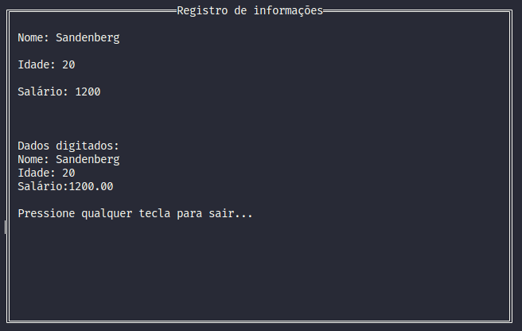

# Biblioteca em C com funções para criação de janelas de terminal

## Feito para a disciplina de Programação Estruturada
## Curso de Ciência da Computação - IFCE - Campus Iguatu

### Para compilar use o comando `make` na raiz do projeto.
### Para executar use o comando `make run` na raiz do projeto.
### No arquivo main.c tem um exemplo de uso (muito simples) da biblioteca.
